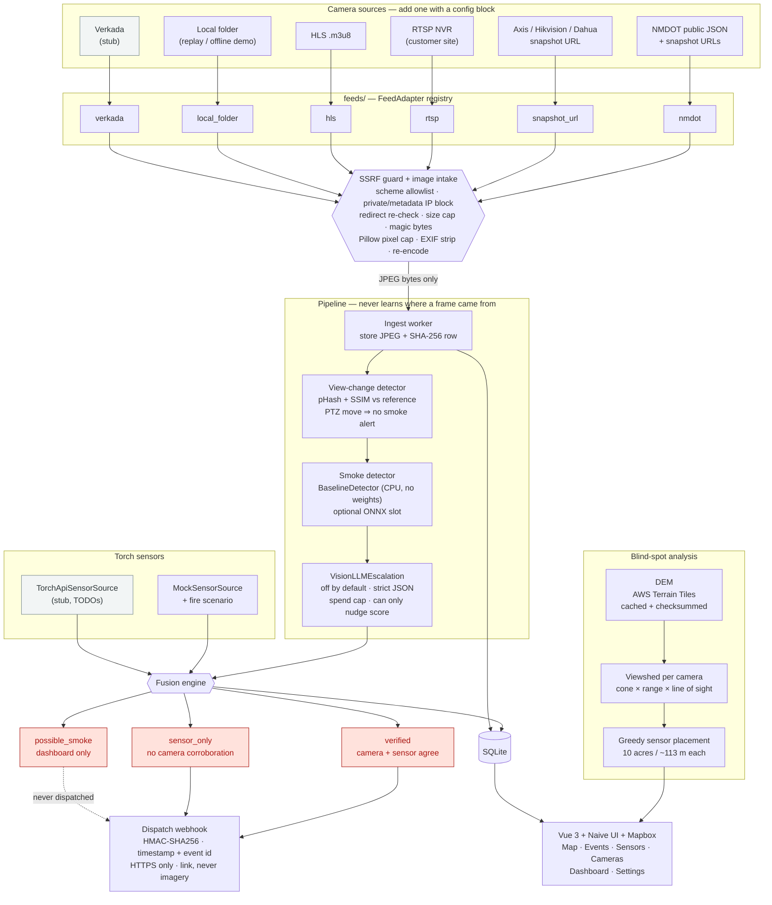

# Architecture

## Block diagram



## The same thing in plain text

```
  public DOT JSON ─┐
  Axis/Hikvision  ─┤
  RTSP NVR        ─┼──▶  FeedAdapter  ──▶  SSRF guard ──▶  JPEG bytes
  HLS stream      ─┤     (one file +       + image             │
  local folder    ─┤      config block)     intake             │
  Verkada (stub)  ─┘                                           │
                                                               ▼
                                       ┌───────────────────────────────┐
                                       │  ingest → view-change → score │
                                       └───────────────┬───────────────┘
                                                       │  score ≥ threshold
                                                       ▼
   Torch sensors ──────────────────────────▶  ┌────────────────┐
   (mock now, real API later)                 │ FUSION ENGINE  │
                                              └───┬───┬────┬───┘
                        no sensor agrees ─────────┘   │    └───── sensor alone
                                │                     │                │
                                ▼                     ▼                ▼
                        possible_smoke            verified        sensor_only
                        (dashboard only)      (camera+sensor)   (sensors see what
                                │                     │          cameras cannot)
                                │                     │                │
                          ✗ never sent                └──── dispatch ──┘
                                                       (HMAC-signed, link only)
```

## Why the boundaries sit where they do

**The adapter boundary is the whole point.** `FeedAdapter` returns JPEG bytes
and nothing else. Ingest, view-change, detection, fusion and the UI have no
idea whether a frame came from a state DOT's public API, an RTSP camera behind
a customer's firewall, or a folder on disk. That is what makes "new feed = one
file plus a config block" true rather than aspirational, and
`tests/test_fake_adapter_flow.py` enforces it by driving an invented feed type
end to end without touching the pipeline.

**Every byte from a camera crosses one guarded doorway.** No adapter fetches
anything itself: they all call `safe_fetch` and `normalise_to_jpeg`. A feed is
untrusted input — a hostile camera name, a redirect to the cloud metadata
service, a 4 GB "JPEG", a decompression bomb — and a single choke point means a
fix applies to all six adapters at once.

**Fusion is the product decision, isolated in one module.** `possible_smoke`
never leaves the dashboard; only `verified` and `sensor_only` dispatch. That
rule lives in `should_dispatch()`, is re-asserted in the dispatcher, and is
covered by tests, because it is the thing that must not drift.

**The sensor source is an interface, not an assumption.** Fusion consumes
`SensorReading` objects. Swapping `MockSensorSource` for the real Torch API is
one class, with no change to fusion, the schema or the UI.
